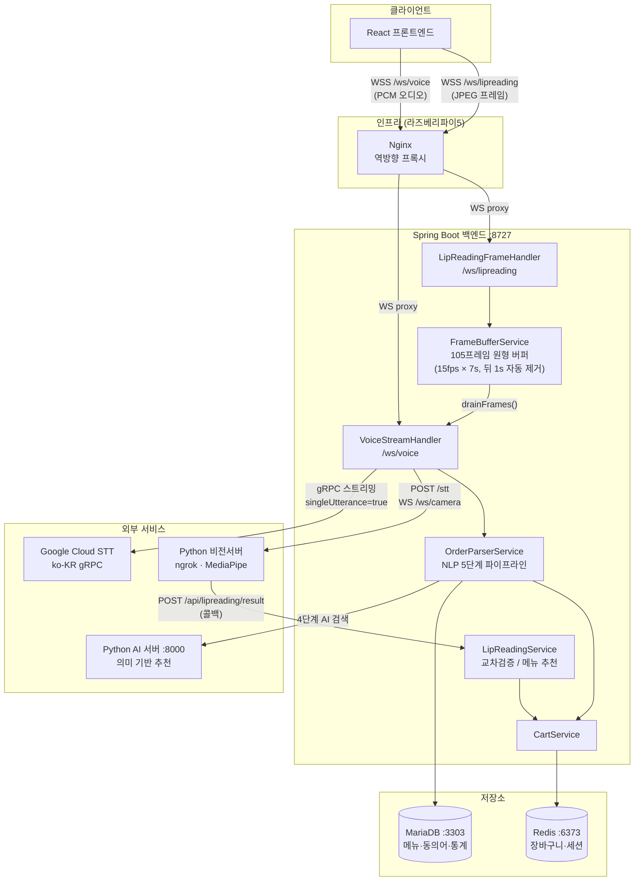
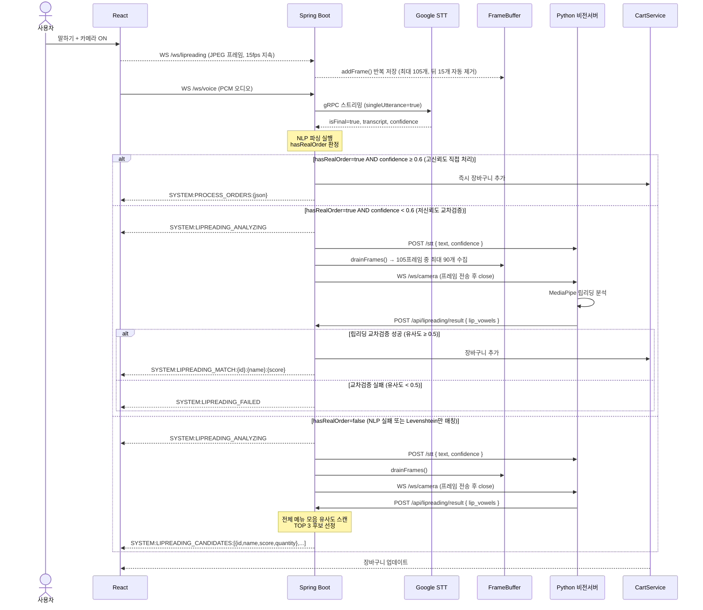
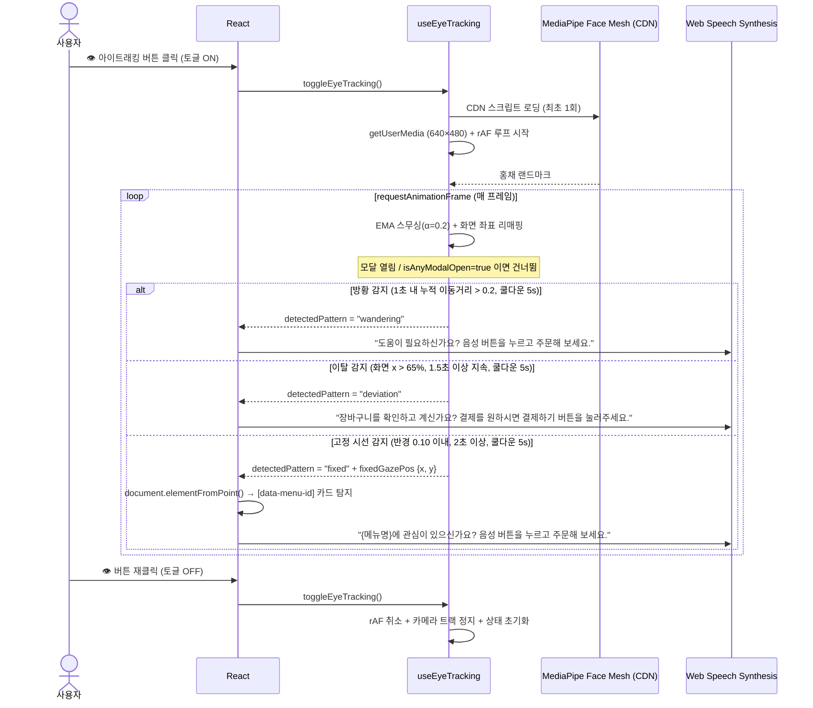
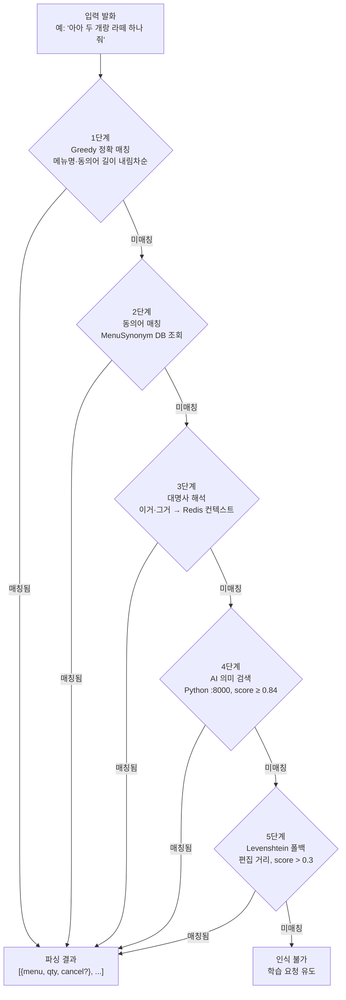
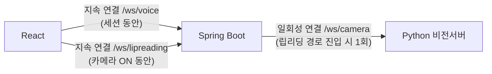
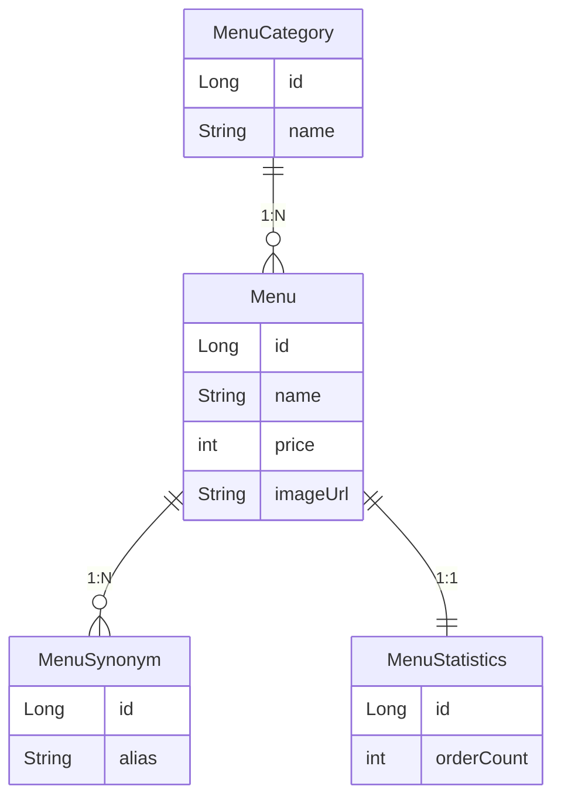

# 자연어 맥락 이해 기반 대화형 키오스크 시스템 — 구조도

---

## 1. 시스템 컴포넌트 구조

---

## 2. 음성 주문 + 립리딩 융합 시퀀스

---

## 3. 아이트래킹 기반 TTS 맥락 안내 시퀀스

---

## 4. NLP 주문 파싱 파이프라인

> **Levenshtein 폴백 주의**: 5단계만 매칭된 결과는 `isLearnedMatch=false, isUnknown=false`이나 `hasRealOrder=false`로 판정되어 립리딩 추천 경로로 자동 라우팅됩니다.

---

## 5. WebSocket 연결 구조 요약

---

## 6. 데이터 저장소 구조

---

# 🏗️ 시스템 아키텍처

### 1. 사용자 브라우저 (React Frontend)

- **사용자 UI 제공 및 화면 렌더링**: 메뉴 그리드, 장바구니, 주문 처리 상태 표시.
- **실시간 오디오 처리 (WebAudio API)**: `AudioWorklet`을 활용해 마이크 입력(Float32)을 STT 규격인 PCM(Int16, 16kHz)으로 실시간 변환하여 `/ws/voice`로 스트리밍.
- **카메라 프레임 전송**: `setInterval` + Canvas API로 15fps 주기로 프레임을 JPEG 바이너리로 인코딩하여 `/ws/lipreading` WebSocket으로 전송. 카메라가 켜져 있는 동안 상시 연결 유지.
- **WebSocket 이중 연결**: `/ws/voice`(음성)와 `/ws/lipreading`(카메라) 두 채널을 동시에 유지하며, 백엔드로부터 주문 분석 결과를 실시간으로 수신.
- **비동기 주문 처리 큐 (Order Queue)**: 백엔드에서 온 복합 주문 결과를 순차적으로 모달(Quantity, Fallback)로 띄워 사용자 피드백 수집.
- **립리딩 결과 처리**: `SYSTEM:LIPREADING_MATCH` 수신 시 자동 장바구니 반영, `SYSTEM:LIPREADING_CANDIDATES` 수신 시 TOP 3 후보를 사용자 확인 모달로 표시, `SYSTEM:LIPREADING_FAILED` 수신 시 인식 실패 알림.
- **아이트래킹 기반 TTS 맥락 안내 (선택적)**: 풋터의 👁️ 버튼으로 토글 활성화. MediaPipe Face Mesh CDN을 런타임에 지연 로딩하여 홍채 랜드마크(#468·#473)를 추적. EMA 스무싱과 좌표 리매핑 후 세 가지 패턴을 감지해 Web Speech Synthesis로 상황에 맞는 안내를 제공: ① **방황** — 1초 내 누적 이동거리 > 0.2 시 주문 방법 안내, ② **이탈** — 화면 우측 65% 이상(장바구니 영역)을 1.5초 응시 시 결제 안내, ③ **고정** — 반경 0.10 이내 2초 이상 응시 시 해당 메뉴 카드를 DOM에서 탐지하여 메뉴별 주문 유도. 동일 패턴 5초 쿨다운, 모달 열림 중 감지 일시정지.

### 2. Web Server (Nginx, 라즈베리파이5)

- **Reverse Proxy**: `duckdns.org` 도메인 기반 라우팅 및 백엔드 대리 요청.
- **WebSocket 프록시**: `/ws/voice`, `/ws/lipreading` 두 경로 모두 `proxy_http_version 1.1` 및 `Upgrade` 헤더로 WebSocket 업그레이드 처리.
- **SSL/HTTPS 보안**: Let's Encrypt 기반 보안 통신.
- **정적 리소스 서빙**: 메뉴 이미지 파일(`kiosk_uploads`)에 대한 외부 접근 핸들링.

### 3. Core Backend (Spring Boot, 포트 8727)

- **VoiceStreamHandler (`/ws/voice`)**: Google STT(`singleUtterance=true`)와 브라우저 사이의 오디오 스트림 중계. `isFinal=true` 수신 시 NLP 파싱 후 `hasRealOrder` + `confidence` 기준으로 3경로 분기.
  - **STT 스트림 생명주기 — 지연(Lazy) 재시작**: 발화 완료(`isFinal=true`) 또는 오류(`onError`) 시 스트림만 제거하고 즉시 재시작하지 않음. 다음 오디오 청크가 도착할 때 스트림이 없으면 그때 생성. 이를 통해 빈 스트림이 지속돼 발생하는 `OUT_OF_RANGE: Audio Timeout` 무한 루프를 방지.
  - **Stale 콜백 보호 (`AtomicReference`)**: `startSttStream()` 내부에서 생성된 `ClientStream` 인스턴스를 `AtomicReference`로 보관. `onError`·`onComplete` 콜백에서 현재 맵에 등록된 스트림과 참조를 비교하여, 이미 새 스트림으로 교체된 뒤 늦게 도착한 구 스트림의 콜백은 무시.
  - **3-경로 분기 (`hasRealOrder` × `confidence`)**:
    - `hasRealOrder=true` + `confidence ≥ 0.6` → **즉시 처리**: 장바구니 직접 추가 후 `SYSTEM:PROCESS_ORDERS:{json}`.
    - `hasRealOrder=true` + `confidence < 0.6` → **교차 검증**: `storePendingOrders`, 프레임 전달, `SYSTEM:LIPREADING_ANALYZING`.
    - `hasRealOrder=false` (Levenshtein만 매칭 포함) → **립리딩 추천**: confidence 무관하게 프레임 전달, `SYSTEM:LIPREADING_ANALYZING`.
  - **`hasRealOrder` 조건**: NLP 결과 중 `isUnknown=false`, `isLearnedMatch=false`이면서 `isAllCancel`, `isMenuAllCancel`, `isCancel`, 또는 `quantity > 0` 중 하나라도 해당하는 항목이 있어야 `true`. Levenshtein 폴백으로만 매칭된 경우(`quantity=0`인 결과) 등은 `false` 처리.

- **LipReadingFrameHandler (`/ws/lipreading`)**: 브라우저에서 상시 전송되는 카메라 JPEG 프레임을 수신하여 `FrameBufferService`에 저장.

- **FrameBufferService**: `ConcurrentLinkedDeque` 기반 원형 버퍼로 최근 **105프레임(15fps × 7초)**을 유지. `drainFrames()` 호출 시 전체 프레임을 추출하되 마지막 15프레임(1초)을 자동 제거하여 발화 후 무음 구간 노이즈 감소.

- **Hybrid Order Parser (`OrderParserService`)**: 규칙 기반(Greedy Match)과 AI 기반(Semantic Search) 로직을 결합한 5단계 복합 주문 분석 엔진. 결과 각 항목에 `isUnknown`, `isLearnedMatch`, `isAllCancel`, `isCancel`, `isMenuAllCancel`, `quantity`, `menuDto` 필드를 포함.

- **LipReadingService**: 비전 서버 콜백으로 받은 `lip_vowels` 배열을 처리. `LipReadingSessionContext.hasPendingOrders()` 여부로 두 경로 중 하나 실행:
  - **교차 검증 (`processCrossValidation`)**: 보류된 NLP 주문 각각의 메뉴명 모음 vs 입술 모음 Levenshtein 유사도 계산. `bestScore ≥ 0.5`이면 장바구니 추가 + `SYSTEM:LIPREADING_MATCH:{id}:{name}:{score}`. `bestOrder==null`(유효한 후보 없음, 예: Levenshtein 주문만 존재) 시 `processRecommendation`으로 전환. `bestScore < 0.5`이면 `SYSTEM:LIPREADING_FAILED`.
  - **추천 (`processRecommendation`)**: 전체 메뉴 스캔 → 각 메뉴명 모음 vs 입술 모음 유사도 계산 → 상위 3개 추출 → 최고점 ≥ 0.3이면 `SYSTEM:LIPREADING_CANDIDATES:[{"id":N,"name":"...","score":0.XX,"quantity":1},...]` 전송. 최고점 < 0.3이면 `SYSTEM:LIPREADING_FAILED`.

- **LipReadingSessionContext**: STT 완료 시 `VoiceStreamHandler`가 세션·텍스트·confidence·pendingOrders를 저장, 립리딩 콜백 시 `LipReadingService`가 읽는 단일 공유 컨텍스트(`volatile` 필드). `store()` 호출 시 `pendingOrders`를 빈 리스트로 초기화하여 이전 STT의 stale 상태가 남아있는 레이스 컨디션 방지. `tryConsumeLipReading()` 플래그로 동일 STT 발화에 대해 립리딩 결과가 중복 처리되는 것을 방지.

- **MenuLearningService**: 사용자의 피드백을 기반으로 `MenuSynonym`을 자동 학습 및 정제.

- **Context & Statistics Management**: 주문 통계 기록 및 마지막 주문 맥락 유지.

### 4. Database & Cache

- **MariaDB (RDB)**: 메뉴 정보, 카테고리, 다양한 동의어(Menu, Quantity, Pronoun, Cancel) 테이블 및 주문 통계 데이터 저장.
- **Redis (In-Memory)**: 세션별 실시간 장바구니(`cart:{sessionId}`, TTL 30분) 데이터 관리 및 대명사 처리를 위한 마지막 주문 맥락(`order_context:{sessionId}`, TTL 10분) 캐싱.

### 5. AI 추천 서버 (Python/FastAPI, 포트 8000)

- **Semantic Search API**: `multilingual-e5-large` 임베딩 모델을 활용한 의미 기반 메뉴 검색 기능 제공.
- **Vector Database (ChromaDB)**: 메뉴별 `semanticContext`를 벡터화하여 저장 및 코사인 유사도 기반 검색.
- **Intelligent Filtering**: 최고점 기준 상대적 임계값(`maxScore - 0.05`) 필터링 및 절대 임계값(`score ≥ 0.84`) 필터링 적용 후 결과 반환. Spring Boot에서도 `score ≥ 0.5` 추가 필터 적용.

### 6. 비전 서버 (Python, ngrok 터널)

- **립리딩 분석 (`/ws/camera`)**: Spring Boot로부터 JPEG 프레임 배열을 WebSocket으로 수신하여 MediaPipe 기반 입술 움직임 분석.
- **STT 컨텍스트 수신 (`POST /stt`)**: 분석 시작 전 Spring Boot로부터 STT 텍스트와 confidence 값을 REST로 전달받아 분석 기준으로 활용.
- **콜백 (`POST /api/lipreading/result`)**: 분석 완료 후 추출한 입술 모음 배열(`lip_vowels`)을 Spring Boot로 역전송.

### 7. 외부 서비스 (External Services)

- **Google Speech-to-Text (STT)**: gRPC 스트리밍 인식 API를 통해 오디오를 실시간으로 한국어 텍스트로 변환. `singleUtterance=true`로 한 발화 완결 후 자동 종료. `isFinal=true` 결과에 confidence(0.0~1.0) 포함.

---

# ☕ 시스템 흐름도

지능형 키오스크는 **[입력 - 분석 - 신뢰도 판단 - 융합/확정 - 피드백]** 의 5단계 순환 구조를 가집니다.

### 1. 음성 + 카메라 입력 (Input Stage)

사용자가 말을 시작하면 두 채널이 동시에 데이터를 전송합니다.

- **오디오 전처리**: 브라우저의 `AudioWorklet`이 마이크 입력을 Google STT 규격인 PCM(Int16, 16kHz) 포맷으로 실시간 변환하여 `/ws/voice`로 스트리밍.
- **카메라 프레임 버퍼링**: 별도로 `/ws/lipreading`을 통해 15fps로 JPEG 프레임이 지속 전송되며, 백엔드 `FrameBufferService`가 최근 **105프레임(7초 분량)**을 원형 버퍼로 유지. `drainFrames()` 시 마지막 1초(15프레임)는 발화 후 무음 구간으로 자동 제거.
- **STT 스트리밍 및 재시작**: `singleUtterance=true` 모드로 발화 1회 완결 시 자동 종료. 다음 발화의 첫 오디오 청크가 도착할 때 스트림을 재생성하는 지연(Lazy) 재시작 방식을 사용하여 무한 루프 방지.

### 2. 하이브리드 주문 분석 (Analysis Stage)

STT 텍스트를 실제 주문 데이터로 변환하는 핵심 파이프라인입니다.

- **규칙 기반 매칭 (Greedy Match)**: DB에 저장된 메뉴명이나 별칭(Synonym)과 텍스트를 길이 내림차순으로 대조하여 즉시 매칭 시도.
- **지시어 및 맥락 분석**: "이거", "그거"와 같은 대명사가 감지되면 Redis에 저장된 이전 주문 맥락(OrderContext, TTL 10분)을 참조하여 대상 메뉴를 특정.
- **수량 및 취소 분석**: 문장에서 "하나", "두 개"와 같은 수량 키워드와 "빼줘", "취소", "전부" 같은 취소 의도를 분리 정제.
- **AI 시맨틱 검색**: 직접 매칭에 실패하면 Python AI 서버(E5-large 임베딩 + ChromaDB)에 질의하여 의미적으로 가장 가까운 메뉴 후보 추출 (절대 임계값 `score ≥ 0.84`).
- **Levenshtein 폴백**: AI 추천도 실패하면 편집 거리 기반 근사 매칭(score > 0.3)으로 최후 시도. **Levenshtein만 매칭된 경우 `hasRealOrder=false`로 판정하여 자동으로 립리딩 추천 경로로 라우팅.**

### 3. 신뢰도 기반 3-경로 분기 (Confidence Branching Stage)

NLP 결과의 질(`hasRealOrder`)과 Google STT `confidence`를 조합하여 세 경로 중 하나를 선택합니다.

- **경로 A — 고신뢰도 직접 처리** (`hasRealOrder=true` AND `confidence ≥ 0.6`): NLP가 실제 주문을 찾았고 음성 인식이 정확하다고 판단. 분석 결과를 즉시 장바구니에 반영하고 `SYSTEM:PROCESS_ORDERS:{json}` 메시지로 프론트에 알림. 비전 서버 호출 없음.
- **경로 B — 저신뢰도 교차 검증** (`hasRealOrder=true` AND `confidence < 0.6`): NLP는 메뉴를 찾았으나 발음이 불명확할 수 있다고 판단. 보류 주문(`pendingOrders`)을 저장하고, `SYSTEM:LIPREADING_ANALYZING`을 프론트에 전송한 뒤 버퍼 프레임을 비전 서버로 전달하여 입술 모양 교차 검증.
- **경로 C — NLP 실패 립리딩 추천** (`hasRealOrder=false`): NLP가 Levenshtein 폴백으로만 매칭하거나 아예 실패한 경우. confidence 값과 무관하게 `SYSTEM:LIPREADING_ANALYZING`을 전송하고 비전 서버에 프레임을 전달. `pendingOrders`가 없으므로 전체 메뉴 스캔 후 TOP 3 추천 모드로 진행.

### 4. 립리딩 융합 판단 (Lip-Reading Fusion Stage)

경로 B 또는 C로 진입했을 때만 동작하는 추가 분석 단계입니다.

- **비전 서버 호출**: 백엔드가 STT 텍스트를 REST(`POST /stt`)로 먼저 전달한 뒤, 버퍼의 JPEG 프레임(최대 90프레임 — 7초 버퍼에서 마지막 1초 제거)을 WebSocket(`/ws/camera`)으로 순차 전송하고 연결 종료.
- **MediaPipe 분석**: 비전 서버가 각 프레임에서 입술 랜드마크를 추출하여 모음 시퀀스(`lip_vowels`)를 생성, 콜백(`POST /api/lipreading/result`)으로 역전송.
- **경로 B — 교차 검증 융합 (`processCrossValidation`)**: 보류 주문의 각 메뉴명에서 한국어 모음을 추출하고 입술 모음 배열과 Levenshtein 유사도 비교. 최고 유사도 메뉴의 점수가 0.5 이상이면 자동 장바구니 추가 + `SYSTEM:LIPREADING_MATCH:{id}:{name}:{score}`. 유효한 후보가 없으면(Levenshtein 주문만 존재 등) 경로 C 추천 로직으로 전환. 유사도 < 0.5이면 `SYSTEM:LIPREADING_FAILED`.
- **경로 C — 전체 메뉴 추천 융합 (`processRecommendation`)**: 전체 메뉴를 스캔하여 각 메뉴명 모음 vs 입술 모음 유사도 계산. 상위 3개 중 최고점 ≥ 0.3이면 `SYSTEM:LIPREADING_CANDIDATES:[{"id":N,"name":"...","score":0.XX,"quantity":1},...]`를 전송하여 프론트에서 사용자 확인 모달 표시. 최고점 < 0.3이면 `SYSTEM:LIPREADING_FAILED`.

### 5. 피드백 및 자가 학습 (Feedback & Learning Stage)

분석 결과를 확정하고 시스템 지능을 고도화합니다.

- **주문 확정 및 장바구니**: 확신이 있는 주문은 Redis 장바구니에 즉시 반영. 교차 검증 성공 시 `SYSTEM:LIPREADING_MATCH`, 추천 선택 확정 시 프론트가 REST API를 통해 최종 추가.
- **자가 학습 (Self-Learning)**: 사용자가 `POST /api/learning`으로 발화와 메뉴 ID를 제출하면, 해당 발화를 정제하여 새로운 `MenuSynonym`으로 DB에 저장. 이후 동일 발화는 AI나 립리딩 없이 1단계에서 즉시 매칭.

---

## 📊 시스템 레이아웃 요약

| **단계** | **담당 컴포넌트** | **주요 기술/도구** |
|----------|------------------|--------------------|
| **청취** | React Frontend | AudioWorklet, WebSocket(/ws/voice) |
| **촬영** | React Frontend | Canvas API, WebSocket(/ws/lipreading) |
| **시선 추적** | React Frontend | MediaPipe Face Mesh, rAF, Web Speech Synthesis |
| **번역** | Spring Boot + Google STT | gRPC Streaming, ko-KR, singleUtterance |
| **분석** | OrderParserService | Greedy Match, Redis Context, Levenshtein, hasRealOrder 판정 |
| **사고** | Python AI 서버 | E5-large Embedding, ChromaDB, score ≥ 0.84 |
| **관찰** | Python 비전서버 | MediaPipe, 입술 랜드마크, 105프레임 버퍼 |
| **융합** | LipReadingService | 모음 추출, Levenshtein 유사도, 교차검증 / 추천 2-경로 |
| **성장** | MenuLearningService | DB Synonym Auto-Update |
